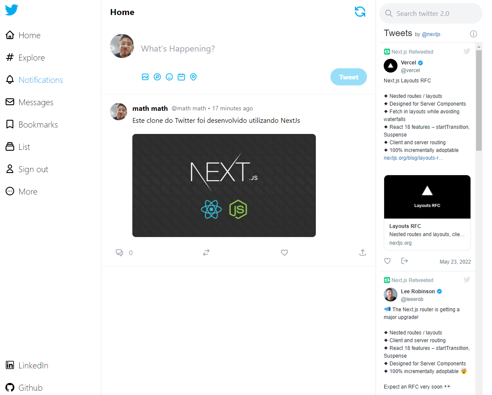

# Twitter Clone UI

> Twitter Social Media clone - Using the main development technologies

 [](https://github.com/matheus13f)
[](#)
[](https://github.com/matheus13f/Twitter-NextJS/stargazers)
[](https://github.com/matheus13f/Twitter-NextJS/network/members)
[](https://github.com/matheus13f/Twitter-NextJS/graphs/contributors)

# :pushpin: Table of Contents

* [Features](#rocket-features)
* [UI Documentation](#framed_picture-ui-documentation)
* [Installation](#construction_worker-installation)
* [Getting Started](#runner-getting-started)
* [FAQ](#postbox-faq)
* [Found a bug? Missing a specific feature?](#bug-issues)
* [Contributing](#tada-contributing)
* [License](#closed_book-license)

<br />

# :rocket: Features

* login authentication with Twitter  
* make tweets with images
* comment on your friends tweets


# :framed_picture: UI Documentation
This project has a UI Documentation of reusable components, allowing to test them individually.

<p align="center">
   
</p>

# :construction_worker: Installation

**You need to install [NPM](https://www.npmjs.com/) and [YARN](https://yarnpkg.com/) first, then in order to clone the project via HTTPS, run this command:**

```sh
git clone https://github.com/matheus13f/Twitter-NextJS.git
```

SSH URLs provide access to a Git repository via SSH, a secure protocol. If you have a SSH key registered in your Github account, clone the project using this command:

```sh
git clone git@github.com:matheus13f/Twitter-NextJS.git
```

**Install dependencies**

You need to install the dependencies of the project, so **run the above command on root folder**:

```yarn```
or
```npm i```

# :runner: Getting Started

Run the following command to start the application in a development environment:

`cd` into the directory.

```sh
cd twitter-nextjs
```
Run the following command

```sh
yarn dev
```
or
```sh 
npm dev 
```

```Happy code \{^-^}/```

# :postbox: Faq

**Question:** What are the technologies used in this project?

**Answer:** The technologies used in this project are [React JS](https://pt-br.reactjs.org/), [Typescript](https://www.typescriptlang.org/) and [Next.JS](https://nextjs.org/)

# :bug: Issues

Feel free to **file a new issue** with a respective title and description on the [Twitter-NextJS](https://github.com/matheus13f/Twitter-NextJS/issues) repository. If you already found a solution to your problem, **i would love to review your pull request**! Have a look at our [contribution guidelines](https://github.com/matheus13f/Twitter-NextJS/blob/master/CONTRIBUTING.md) to find out about the coding standards.

# :tada: Contributing

Check out the [contributing](https://github.com/matheus13f/Twitter-NextJS/blob/master/CONTRIBUTING.md) page to see the best places to file issues, start discussions and begin contributing.

# :closed_book: License

Released in 2022.
This project is free

